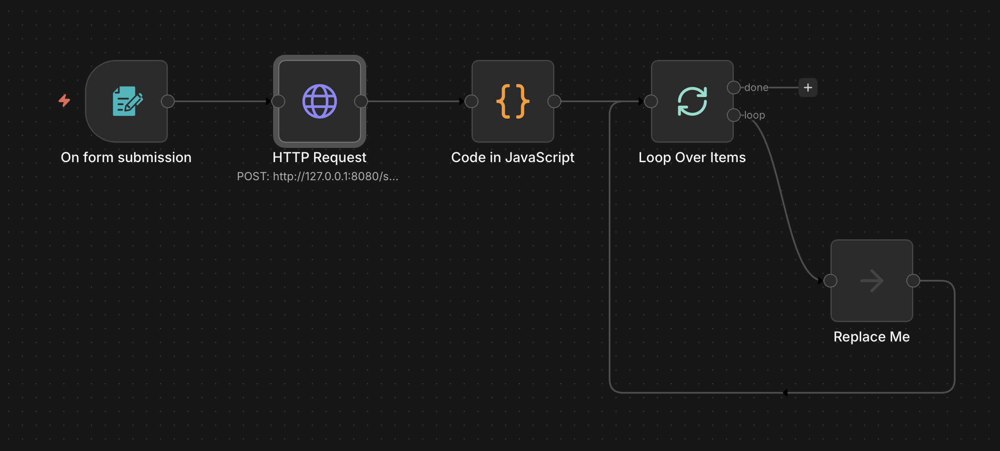

# Audio Splitter Service

A FastAPI-based microservice that splits audio files into smaller chunks using FFmpeg. Designed for containerized deployment with Docker and Kubernetes (Helm).

Perfect for integration with [n8n](https://n8n.io/) workflows - use the HTTP Request node to send audio files and receive chunked results for further processing in your automation pipelines.

## Features

- Split audio files into chunks of specified size (MB)
- Supports multiple audio formats: MP3, WAV, FLAC, OGG, M4A, AAC, WMA, OPUS
- Configurable memory modes (streaming/buffered/auto)
- Returns chunks as base64-encoded data with metadata
- Health and readiness endpoints for Kubernetes
- Non-root container with security best practices

## API Endpoints

### `POST /split`

Split an audio file into chunks.

**Parameters:**
| Parameter | Type | Default | Description |
|-----------|------|---------|-------------|
| `file` | file | required | Audio file to split |
| `chunk_size_mb` | float | 10.0 | Size of each chunk in MB |
| `output_prefix` | string | "chunk" | Prefix for chunk filenames |
| `same_as_input` | bool | true | Use same format as input |
| `output_format` | string | null | Output format (if not same as input) |
| `memory_mode` | string | "auto" | Memory mode: auto, streaming, buffered |

**Response:**
```json
[
  {
    "data": {
      "filename": "chunk_000.mp3",
      "fileExtension": "mp3",
      "mimeType": "audio/mpeg",
      "size": 10485760,
      "sizeInMB": 10.0,
      "originalFile": "song.mp3",
      "duration": 180.5
    },
    "binary": "base64-encoded-audio-data..."
  }
]
```

### `GET /health`

Health check endpoint. Returns `{"status": "healthy"}`.

### `GET /ready`

Readiness check. Verifies FFmpeg is available.

## Quick Start

### Using Docker

```bash
docker build -t audio-splitter .
docker run -p 8000:8000 audio-splitter
```

### Using Docker Compose

```bash
docker compose up
```

## Configuration

Environment variables:

| Variable | Default | Description |
|----------|---------|-------------|
| `MAX_FILE_SIZE_MB` | 500 | Maximum upload file size in MB |
| `STREAMING_THRESHOLD_MB` | 100 | Threshold for streaming mode in MB |

## Kubernetes Deployment

Deploy using Helm:

```bash
helm install audio-splitter ./helm/audio-splitter
```

See `helm/audio-splitter/values.yaml` for configuration options.

## Example Usage

```bash
curl -X POST "http://localhost:8000/split" \
  -F "file=@song.mp3" \
  -F "chunk_size_mb=5" \
  -F "output_prefix=part"
```

## n8n Integration

To use this service in an n8n workflow, add an **HTTP Request** node with the following configuration:

1. **Method:** `POST`
2. **URL:** Your service endpoint with `/split` path
3. **Authentication:** None (or configure as needed)
4. **Send Body:** Enabled
5. **Body Content Type:** `Form-Data`

**Body Parameters:**

| Parameter Type | Name | Value |
|----------------|------|-------|
| n8n Binary File | `file` | Select the binary field from a previous node |
| Form Data | `chunk_size_mb` | Desired chunk size (e.g., `5`) |

Optional parameters can be added as additional Form Data fields:
- `output_prefix` - Prefix for output filenames
- `same_as_input` - Keep original format (`true`/`false`)
- `output_format` - Target format if converting
- `memory_mode` - Processing mode (`auto`, `streaming`, `buffered`)

The response contains an array of chunks with base64-encoded audio data that can be processed by subsequent nodes in your workflow.

### Example Workflow

An example n8n workflow is available in `n8n-test-flow/audio-splitter-workflow.json`. Import it into your n8n instance to get started quickly.



The workflow includes:
- Form trigger for file upload
- HTTP Request configured for the splitter service
- Code node to parse streaming response into binary items
- Loop node to process each chunk

**Note:** After importing, update the URL in the HTTP Request node to match your deployment (e.g., `http://localhost:8000/split` or your Kubernetes service URL).

## License

GNU Affero General Public License v3 (AGPL-3.0)
