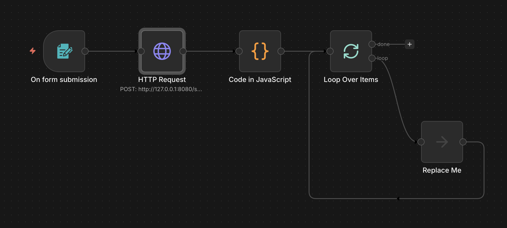

# Audio Splitter

[](https://opensource.org/licenses/MPL-2.0)
[](https://www.python.org/downloads/)
[](https://fastapi.tiangolo.com)

A FastAPI-based HTTP microservice that splits large audio files into smaller chunks using FFmpeg. Designed for integration with workflow automation tools such as n8n, and deployable as a Docker container or Kubernetes workload.

Audio is split without re-encoding — FFmpeg's `-c copy` flag is used throughout, preserving the original quality and making splits fast regardless of file size.

## Features

- **Lossless splitting** — uses FFmpeg segment muxer with `-c copy`, no quality loss
- **Smart bitrate detection** — queries actual bitrate via `ffprobe` to calculate accurate segment durations
- **Memory-aware uploads** — auto, streaming, or buffered mode for handling files of any size
- **Async throughout** — non-blocking I/O via `asyncio` and `aiofiles`
- **Format flexible** — supports mp3, wav, flac, ogg, m4a, aac, wma, opus; the output container can differ from the input if it supports the input codec (audio is copied, never re-encoded)
- **Base64 binary response** — each chunk returned as JSON with metadata and base64-encoded audio data, ready for n8n or any HTTP client
- **Production-ready deployment** — Docker image with Kubernetes Helm chart including optional HPA, security hardening, NetworkPolicy, and ingress support

## Quick Start

### Docker

```bash
docker build -t audio-splitter .
docker run -p 8000:8000 audio-splitter
```

The service is now available at `http://localhost:8000`.

### Local Development

**Prerequisites:** Python 3.14, FFmpeg installed and on `PATH`.

```bash
# Create and activate a virtual environment
python3 -m venv .venv
source .venv/bin/activate

# Install dependencies
pip install -r requirements.txt

# Start the development server
uvicorn app.main:app --reload --host 0.0.0.0 --port 8000
```

## API Reference

### POST /split

Splits an uploaded audio file into chunks of a specified size.

**Content-Type:** `multipart/form-data`

#### Parameters

| Field | Type | Default | Description |
|---|---|---|---|
| `file` | file | required | Audio file to split |
| `chunk_size_mb` | float | `10.0` | Target size of each output chunk in MB (min: 0.1, max: 500) |
| `output_prefix` | string | `chunk` | Filename prefix for generated chunks (alphanumeric, hyphens, underscores only) |
| `same_as_input` | bool | `true` | Keep the same container format as the input |
| `output_format` | string | `null` | Output container, case-insensitive (e.g. `m4a` for AAC input, `ogg` for Opus input). Audio is copied, not re-encoded, so the container must support the input codec, otherwise the request fails with `500`. Only used when `same_as_input` is `false` |
| `memory_mode` | string | `auto` | Upload strategy: `auto` (same as `streaming`), `streaming` (writes the upload to disk in 1 MB chunks), or `buffered` (reads it into memory) |

#### Response

Returns a JSON array. Each element represents one chunk. The `duration` field is the duration of the **original** file in seconds, not the individual chunk.

```json
[
  {
    "data": {
      "filename": "chunk_000.mp3",
      "fileExtension": "mp3",
      "mimeType": "audio/mpeg",
      "size": 5242880,
      "sizeInMB": 5.0,
      "originalFile": "recording.mp3",
      "duration": 3600.0
    },
    "binary": "<base64-encoded audio data>"
  }
]
```

#### Error Responses

| Status | Condition |
|---|---|
| `400` | Unsupported file format, invalid `chunk_size_mb` range, invalid `output_format`, audio bitrate below 1 kbps, or too many chunks generated |
| `413` | File exceeds `MAX_FILE_SIZE_MB` |
| `422` | Request validation error (e.g. non-numeric `chunk_size_mb`, unknown `memory_mode`, missing `file`); `detail` is a list of field errors |
| `500` | FFmpeg could not process the audio (corrupt input, or `output_format` incompatible with the input codec), processing timed out (`FFMPEG_TIMEOUT_SECONDS`), or unexpected server error |

Processing errors (`500`) include a correlation ID that matches the server log entry:
```json
{"detail": "Audio processing failed. Reference: a1b2c3d4-..."}
```

#### Example

```bash
curl -X POST http://localhost:8000/split \
  -F "file=@recording.mp3" \
  -F "chunk_size_mb=5" \
  -F "output_prefix=part" \
  -F "same_as_input=true" \
  -F "memory_mode=auto"
```

---

### GET /health

Returns service health status. Used as a liveness probe in Kubernetes.

**Response:**
```json
{"status": "healthy"}
```

---

### GET /ready

Verifies that FFmpeg is installed and accessible. Used as a readiness probe in Kubernetes.

**Response (200):**
```json
{"status": "ready"}
```

**Response (503):** returned when FFmpeg is not found on `PATH`, is not executable, exits with an error, or does not respond within `FFPROBE_TIMEOUT_SECONDS`.

---

## Configuration

Configuration is provided through environment variables. For local runs you can copy `.env.example` to `.env` and pass `--env-file .env` to `uvicorn` or `docker run`; the app does not read `.env` on its own.

| Variable | Default | Description |
|---|---|---|
| `MAX_FILE_SIZE_MB` | `500` | Maximum accepted upload size in MB. Enforced after the upload has been received, so also cap the request body at your ingress or proxy (e.g. nginx `client_max_body_size`) |
| `FFMPEG_TIMEOUT_SECONDS` | `300` | Maximum time in seconds for FFmpeg split operations before killing the process |
| `FFPROBE_TIMEOUT_SECONDS` | `30` | Maximum time in seconds for ffprobe metadata queries and readiness checks |
| `CHUNK_SIZE_MB_MIN` | `0.1` | Minimum allowed value for `chunk_size_mb` |
| `CHUNK_SIZE_MB_MAX` | `500` | Maximum allowed value for `chunk_size_mb` |
| `MAX_CHUNKS` | `1000` | Maximum number of output chunks per request |

## Deployment

### Docker

Build and run the production image:

```bash
docker build -t audio-splitter:latest .
docker run -d \
  -p 8000:8000 \
  -e MAX_FILE_SIZE_MB=1000 \
  audio-splitter:latest
```

### Kubernetes (Helm)

The Helm chart is located in `helm/audio-splitter/`.

**Basic install:**

```bash
helm install audio-splitter ./helm/audio-splitter \
  --set image.repository=your-registry/audio-splitter \
  --set image.tag=latest
```

**Key `values.yaml` options:**

| Key | Default | Description |
|---|---|---|
| `image.repository` | `audio-splitter` | Container image repository |
| `image.tag` | `""` (uses chart appVersion) | Image tag |
| `service.type` | `ClusterIP` | Kubernetes service type |
| `resources.limits.memory` | `2Gi` | Memory limit per pod |
| `resources.limits.cpu` | `2000m` | CPU limit per pod |
| `ingress.enabled` | `false` | Enable ingress resource (configure TLS before enabling) |
| `autoscaling.enabled` | `false` | Enable Horizontal Pod Autoscaler |
| `persistence.enabled` | `false` | Mount a PVC at `persistence.mountPath` and use it as `TMPDIR` for uploads and chunks. Single replica only with the default `ReadWriteOnce` access mode |
| `networkPolicy.enabled` | `true` | Restrict pod ingress/egress with a NetworkPolicy |
| `securityContext.readOnlyRootFilesystem` | `true` | Mount root filesystem as read-only |
| `serviceAccount.automount` | `false` | Auto-mount Kubernetes API token |
| `replicaCount` | `1` | Number of pod replicas |

The chart includes:
- Horizontal Pod Autoscaler (HPA, disabled by default)
- Persistent Volume Claim (PVC, disabled by default)
- NetworkPolicy restricting traffic to port 8000 ingress and DNS egress
- Pod security context (`runAsNonRoot`, `readOnlyRootFilesystem`, dropped capabilities)
- Liveness and readiness probes wired to `/health` and `/ready`

## n8n Integration

An example n8n workflow is provided in `n8n-test-flow/audio-splitter-workflow.json`. The flow demonstrates a complete pipeline:

1. **Form Trigger** — accepts an audio file upload via a web form
2. **HTTP Request** — posts the file to `POST /split` on this service
3. **Code (JavaScript)** — parses the JSON response array and decodes base64 binary data into n8n binary items
4. **Loop Over Items** — iterates over each chunk for downstream processing



To use the example flow:

1. Import `n8n-test-flow/audio-splitter-workflow.json` into your n8n instance via **Workflows > Import from file**
2. Update the HTTP Request node URL to point to your deployed Audio Splitter service
3. Replace the **Replace Me** node with your desired action (e.g. upload to S3, send via email, store in Google Drive)

## Contributing

1. Fork the repository
2. Create a feature branch: `git checkout -b feat/my-feature`
3. Commit your changes following the conventional commits format: `feat(scope): description`
4. Open a pull request against `main`

Bug reports and feature requests are welcome via [GitHub Issues](https://github.com/blackaxgit/audio-splitter/issues). Do not report security vulnerabilities in public issues; see [SECURITY.md](SECURITY.md).

## License

This project is licensed under the [Mozilla Public License 2.0](LICENSE).

Under MPL-2.0, you may use, modify, and distribute this software. Modifications to MPL-licensed files must be released under the same license, but you may combine this code with files under other licenses in a larger work without those files being affected.
